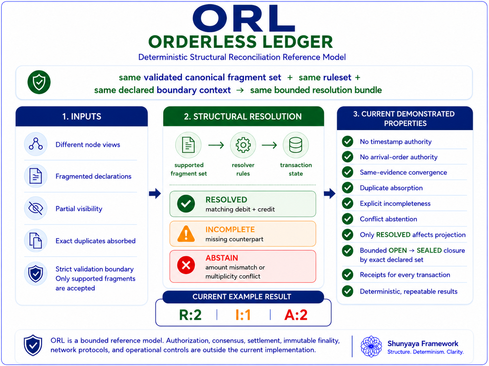

# ⭐ **ORL — Orderless Ledger**

**Deterministic • Order-Free • Time-Independent • Structure-Based Resolution • Open Reference Implementation**

[](https://github.com/OMPSHUNYAYA/Orderless-Ledger/actions/workflows/verify.yml)


**No Time • No Order • No Coordinator**

**No GPS • No NTP • No Internet Required for Correctness**

---

**Correctness derived from structure — not from order, timestamps, or synchronization**

**Using concepts from Shunyaya Structural Universal Mathematics (SSUM)**

---

## 🧾 **One-Line Story**

From **SSUM-Time** (time reconstructed from structure)  
to **STOCRS** (computation reconstructed from structure)  
to **ORL** (ledger truth reconstructed from structure):

A deterministic structural ledger model  
where independent nodes can begin differently and still converge to the same final truth.

---

## ⚡ **A Radical Idea**

ORL explores a simple but profound possibility:

A ledger may not need order, synchronized time, or a central coordinator to remain correct.

Instead of relying on:

- ordered transaction logs  
- timestamps  
- synchronized clocks  
- continuous coordination  
- centralized correctness authority  

ORL demonstrates:

- incomplete fragments can exist safely  
- arrival order can remain unknown  
- nodes can remain independent  
- sharing can be delayed and bounded  
- conflicting structure can be safely contained  

And still:

**the same final truth emerges deterministically**

---

## 🧭 **Visual Overview**



A structural ledger model where correctness emerges from completeness and consistency — not from order or time.

---

## ⚖️ **What ORL Is / Is Not**

### **ORL IS**

- a structural ledger model  
- a deterministic resolution system  
- a proof that ledger correctness need not depend on order  
- a structure-first demonstration of multi-node convergence  
- a domain application of broader structural correctness ideas  

### **ORL IS NOT**

- a full banking platform  
- a blockchain replacement claim  
- a consensus protocol  
- a performance optimization claim  
- a claim that all real-world ordering becomes unnecessary  

**It is a deeper shift:**

**ledger truth is derived from structure, not from sequence**

---

## 🧭 **Core Principle**

`correctness = structure`

Not:

`correctness = time + order + synchronization`

---

## ⚡ **What This Proves (In One Line)**

Independent ledger nodes can begin with different incomplete fragments, share information later, and still converge deterministically to the same final truth without relying on transaction order, timestamps, or a central coordinator.

---

## 🛡 **Classical Compatibility Guarantee**

ORL is a **conservative structural extension**.

For all structurally valid transactions:

`classical result = ORL result`

ORL does not change what is considered correct.  
It changes when a system is allowed to accept something as correct.

For incomplete or conflicting structure:

- **INCOMPLETE** → no forced result  
- **ABSTAIN** → no unsafe result  

This ensures:

- no false positives  
- no silent corruption  
- no deviation from valid classical outcomes  

---

## ⚡ **Why This Matters**

Modern systems often assume:

- events must be ordered  
- clocks must be trusted  
- nodes must coordinate continuously  
- replay discipline is required for correctness  

ORL introduces an alternative:

**truth emerges from complete and consistent structure**

This enables:

- correctness under disorder  
- safe incompleteness  
- conflict-safe abstention  
- delayed or bounded sharing  
- deterministic convergence  

---

## 🚀 **Quick Start (30 seconds)**

Run the reference demo:

```
python demo/orl_demo_reference.py
```

Or open:

```
demo/orl_demo_v3.html
```


### **Observe**

- different nodes start with different fragments  
- no timestamps or ordering used  
- incomplete and conflicting states handled explicitly  
- final results converge deterministically  

→ **correctness emerges from structure**

---

## 🔗 Quick Links

### 📘 Docs

- [Quickstart](docs/Quickstart.md)
- [FAQ](docs/FAQ.md)
- [Test Guide](docs/Test-Guide.md)
- [Structural Overview](docs/ORL-Structural-Overview.png)

---

### ⚡ Demos

- [Python Reference Demo](demo/orl_demo_reference.py)
- [Visual Demo (HTML)](demo/orl_demo_v3.html)

---

### 🔍 Verification

- [Verify Instructions](verify/VERIFY.txt)
- [Demo Hash Freeze](verify/FREEZE_DEMO_SHA256.txt)

---

### 📂 Repository

- [demo/](demo/) — reference + visual demonstration  
- [docs/](docs/) — conceptual and usage documentation  
- [verify/](verify/) — reproducibility and hash validation  

---

## 🧩 **Structural Transaction Model**

In ORL, a transaction is treated as **structure**, not sequence.

Example:

`ORL100 = {debit(Alice,500), credit(Bob,500)}`

The key question is not:

**which arrived first**

The key question is:

**is the structure complete and consistent**

---

## 🧭 **Three Resolution States**

- **RESOLVED** → complete and consistent  
- **INCOMPLETE** → missing structure  
- **ABSTAIN** → conflicting structure  

**Meaning**

- valid structure resolves  
- missing structure is not guessed  
- conflicting structure is not forced  

---

## 🌐 **Canonical Demonstration**

### **Scenario**

- 3 independent nodes  
- different local fragments  
- no shared global order  
- no synchronized time required  
- no central coordinator  
- bounded sharing  

### **Outcome**

All nodes converge to the same final state.

Without using:

- order as correctness authority  
- timestamps as correctness authority  
- central coordination  

---

## 📊 **Current Demo Result**

`R:2 I:1 A:2`

Meaning:

- 2 resolved  
- 1 incomplete  
- 2 abstained  

---

## 🔁 **Multi-Node Convergence Model**

Each node begins with:

- different fragments  
- different visibility  
- different timing  

After sharing:

- valid structures resolve  
- incomplete remain incomplete  
- conflicting abstain  

**Final truth becomes identical across nodes**

---

## 🛡 **Safe Incompleteness & Abstention**

ORL does not force completion.

- **INCOMPLETE** → missing parts  
- **ABSTAIN** → conflicting structure  

These are **protections**, not failures.

---

## 🔎 **No Time / No Order / No Coordinator**

ORL does not require:

- ordering authority  
- synchronized clocks  
- timestamps  
- central coordination  
- continuous connectivity  

These may exist — but are not the source of correctness.

---

## 📈 **Practical Meaning**

Traditional:

“Did events arrive in the correct order?”

ORL:

“Is the structure valid?”

---

## 🧠 **Why This Was Hard to See**

Most systems evolved with:

- sequence  
- logs  
- ordering  
- time-based reasoning  

So the assumption became:

`correctness = time + order + coordination`

ORL challenges that.

---

## 🧭 **Why ORL Is Believable**

It follows a progression:

- **SSUM-Time** → time from structure  
- **STOCRS** → computation from structure  
- **ORL** → ledger truth from structure  

---

## 🧪 **Adoption Path**

**Easiest**

- reconciliation systems  
- audit layers  
- offline sync  

**Moderate**

- banking workflows  
- telecom systems  

**Hardest**

- deeply order-dependent systems  

---

## 🧠 **Determinism and Trust**

ORL is:

- deterministic  
- rule-based  
- non-probabilistic  
- structurally verifiable  

Trust comes from:

- explicit rules  
- reproducible behavior  

---

## 🛡 **Conflict Handling**

ORL classifies:

- resolvable  
- incomplete  
- conflicting  

Prevents:

- silent corruption  
- unsafe acceptance  

---

## 📊 **Comparison Snapshot**

| Model | Order as Truth | Time as Truth | Safe Incomplete | Safe Abstain | Deterministic |
|------|---------------|--------------|----------------|-------------|--------------|
| Traditional | YES | OFTEN | LIMITED | LIMITED | CONDITIONAL |
| Blockchain | YES | OFTEN | PARTIAL | PARTIAL | CONDITIONAL |
| Eventual | SOMETIMES | SOMETIMES | PARTIAL | PARTIAL | CONDITIONAL |
| **ORL** | **NO** | **NO** | **YES** | **YES** | **YES** |

---

## 🌍 **Where ORL Matters**

- ledger reconciliation  
- offline financial systems  
- distributed recovery  
- audit systems  
- partial-state convergence  

---

## 🧭 **Architectural Shift**

Traditional:

`time + order + coordination -> correctness`

ORL:

`structure -> correctness`

---

## 📜 **License**

See: [LICENSE](LICENSE)

Reference Implementation: **Open Standard**  
Architecture: CC BY-NC 4.0

---

## 🔗 **Related Projects**

**STOCRS**  
https://github.com/OMPSHUNYAYA/STOCRS

**SSUM-Time**  
https://github.com/OMPSHUNYAYA/SSUM-Time

---

## 🌍 **Long-Horizon Implication**

If correctness does not depend on order, systems may reduce dependence on:

- strict sequencing  
- continuous synchronization  
- coordination overhead  

---

## ⭐ **One-Line Summary**

ORL demonstrates that independent ledger nodes can begin with incomplete and unordered information, share structure later, and still converge deterministically to the same final truth — without relying on time, order, synchronization, GPS, NTP, or continuous connectivity — by resolving only complete and consistent structure and safely isolating incomplete or conflicting data.

